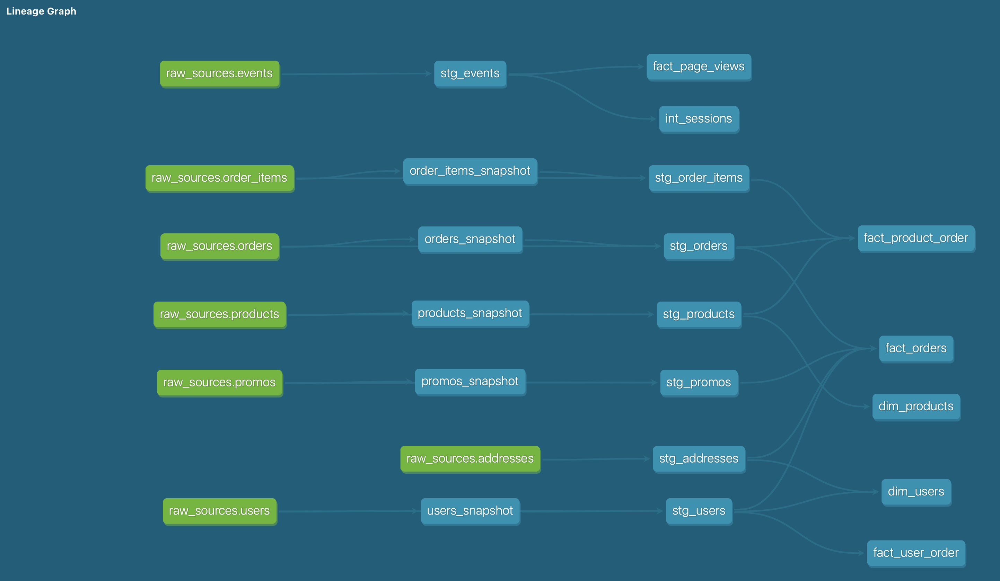

# (Part 1) Models 

## What is our user repeat rate?

Query:
```sql
    with orders_per_user as (
        select 
            user_uuid,
            count(distinct order_uuid) as n_orders
        from dbt_jpramos.stg_orders
        group by 1
    )
    select round(100.0*sum(case when n_orders >=2 then 1 else 0 end)/count(*), 2) as repeat_rate
    from orders_per_user;
```
Result: Our user repeat rate is equal to `80.47%`
    
## What are good indicators of a user who will likely purchase again? What about indicators of users who are likely NOT to purchase again? If you had more data, what features would you want to look into to answer this question?

* `Frequency of purchases`:
    * An user with a relative stable frequency across time (month/day granularity) is a loyal customer;
    * An user with a decline in his/her frequency of purchases might lose its interest in the platform. This, however, does not give any information on one-time purchasers.
* `General activity frequency`
    * By general activity frequency, we mean any kind of logged event in the platform; 
    * An user with high activity across time (adding to cart, viweing pages, etc.) across time, will likely buy again;
    * An user with low activity, however, will not likely buy again. This metric can provide information on one-time purchasers as well.

## Lineage Graph?



# (Part 2) Tests 

* Tests have been added to the staging models, in order to catch data inconsistencies early in the pipeline;

* Data tests should be run whenever there is a run of the DAG (or as introduceed in `v0.21.0`, we can now run `dbt build`). An alert should be sent to the maintainers of the project whenever a test fail.