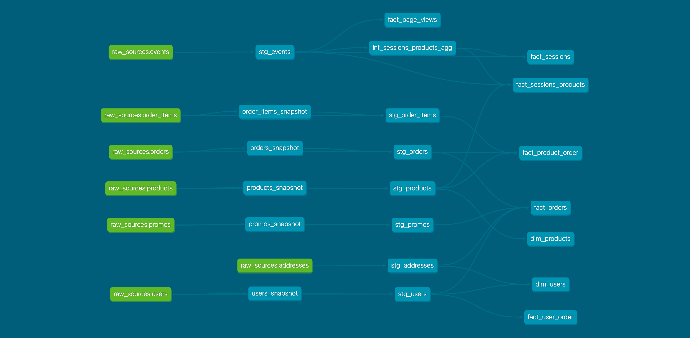

# (1) Create new models to answer the first two questions (answer questions in README file)

## What is our overall conversion rate?

Query:
```sql
    select
        round(100.0 * count(*) FILTER (WHERE number_of_add_to_cart > 0)/count(session_uuid), 2) as add_to_cart_rate,
        round(100.0 * count(*) FILTER (WHERE number_of_checkout = 1)/count(session_uuid), 2) as conversion_rate
    from dbt_jpramos.fact_sessions;
```
Result: Our overall conversion rate is `36.10%`

## What is our conversion rate by product?

Query:
```sql
select
    product_name,
    --round(100.0 * count(*) FILTER (WHERE number_of_product_add_to_cart > 0)/count(distinct session_uuid), 2) as add_to_cart_rate,
    --count(*) FILTER (WHERE number_of_product_add_to_cart > 0),
    --count(*) filter (where number_of_checkout > 1),
    round(100.0 * count(*) FILTER (WHERE product_cart_and_checkout = True) / count(*) FILTER (WHERE number_of_product_add_to_cart > 0), 2) as conversion_rate
from dbt_jpramos.fact_sessions_products
group by 1
order by 1 asc;

```

Result:

|    product_name     | conversion_rate |
|----------------------|-----------------|
| Alocasia Polly | 31.71 |
 Aloe Vera           |           38.00
 Angel Wings Begonia |           42.55
 Arrow Head          |           46.94
 Bamboo              |           50.00
 Bird of Paradise    |           53.49
 Birds Nest Fern     |           50.00
 Boston Fern         |           50.00
 Cactus              |           46.51
 Calathea Makoyana   |           48.98
 Devil's Ivy         |           31.58
 Dragon Tree         |           50.00
 Ficus               |           35.19
 Fiddle Leaf Fig     |           47.83
 Jade Plant          |           34.38
 Majesty Palm        |           55.10
 Money Tree          |           47.22
 Monstera            |           59.46
 Orchid              |           53.19
 Peace Lily          |           59.38
 Philodendron        |           44.00
 Pilea Peperomioides |           44.19
 Pink Anthurium      |           48.98
 Ponytail Palm       |           31.82
 Pothos              |           44.12
 Rubber Plant        |           33.33
 Snake Plant         |           44.68
 Spider Plant        |           47.73
 String of pearls    |           50.91
 ZZ Plant            |           45.45


## (2) Create a macro to simplify part of a model(s).

```yml
macros:
  - name: count_events
    description: Aggregate event_types by session
    docs:
      show: true
    arguments:
      - name: event_types
        type: List[str]
        description: List of possible event types in a session

  - name: apply_grants_select_usage
    description: Apply grants select and usage to a specific role
    docs:
      show: true
    arguments:
      - name: role
        type: str
        description: Name of the role

```

## (3) Add a post hook to your project to apply grants to the role “reporting”

It was added a hook to run at the end of a dbt execution that executes the macro `apply_grants_select_usage` from above.

## (4) Install a package (i.e. dbt-utils, dbt-expectations) and apply one or more of the macros to your project

```yml
packages:
  - package: dbt-labs/dbt_utils
    version: 0.7.4
  - package: dbt-labs/codegen
    version: 0.4.0
```

* `dbt_utils` was used across the project to simplify the development of some queries and in some tests;
* `codegen` was used initially to set the initial staging models and source files;

## Lineage Graph?

