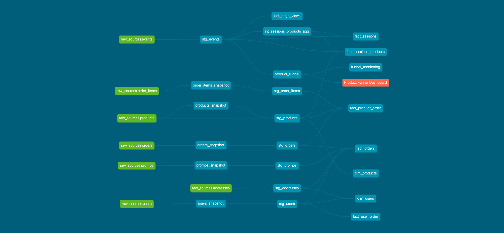

# 1. Modeling challenge

Let’s say that the Director of Product at greenery comes to us (the head Analytics Engineer) and asks some questions:

## How are our users moving through the product funnel?

Query:
```sql
    select 
      * 
    from dbt_jpramos.product_funnel;
```
Result:

| total_sessions | funnel_level_1 | funnel_level_2 | funnel_level_3 |
|----------------|----------------|----------------|----------------|
| 1108 | 696 | 609 | 400 |

## Which steps in the funnel have largest drop off points?

Query:
```sql
    select 
      * 
    from dbt_jpramos.funnel_monitoring;
```
Result:

| field_name | value | pct_change_2lvl_1 | pct_change_2lvl_2 | pct_change_2lvl_3 |
|------------|-------|-----------------|----------------|----------|
 total_sessions |  1108 |            -37.18 |            -45.04 |            -63.90
 funnel_level_1 |   696 |            -12.50 |            -42.53 |                  
 funnel_level_2 |   609 |            -34.32 |                   |                  
 funnel_level_3 |   400 |                   |                   |                               

## In addition to answering these questions right now, we want to be able to answer them at any time. The Product and Engineering teams will want to track how they are improving these metrics on an ongoing basis. As such, we need to think about how we can model the data in a way that allows us to set up reporting for the long-term tracking of our goals.

By setting up the exposure for the product funnel one can schedule its execution and track these metrics while assuring its freshness.

The exposure is the following (also found in `models\exposure.yml`):

```yaml
version: 2

exposures:
  - name: Product Funnel Dashboard
    description: >
      Models that are critical to our product funnel dashboard
    type: dashboard
    maturity: low
    owner:
      name: Joao P. Ramos
      email: jpramos@greenery.com
    depends_on:
      - ref('product_funnel')
```

We then can run all the upstream models of the exposure with the following command on a scheduled basis:

```bash
dbt run -s +exposure:product_funnel
```

## Lineage Graph?



# Reflection questions

## 2A. dbt next steps for you 

dbt is a very powerful tool but analytics engineering goes beyond the tool. I guess my next steps is to consolidate and gain more experience in other topics like data modelling.

## 2B. Setting up for production / scheduled dbt run of your project 

Setting up a project for production, definitely depends on the available hours to put on. Having an orchestrator "on premises" has its own advantages but requires more from the team.

Scheduling depends on the requirements from the different stakeholders. Something to explore in the future is a scheduling more close to "streaming". Another topic to explore more in the future is the use of metadata and its usefulness to monitor the project lifecycle.